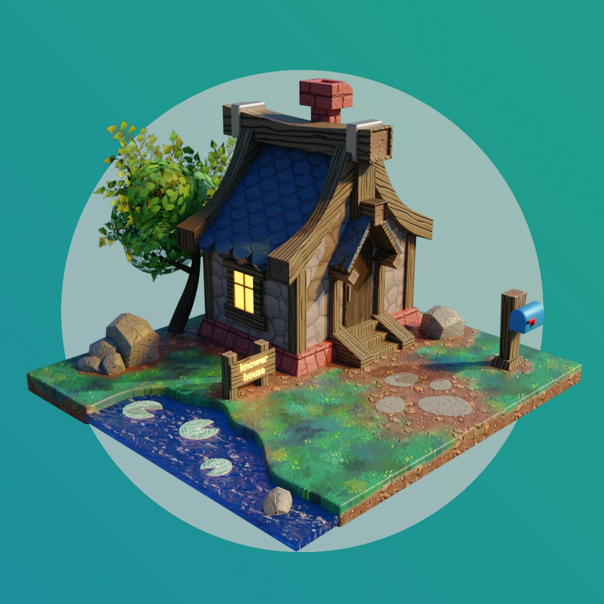
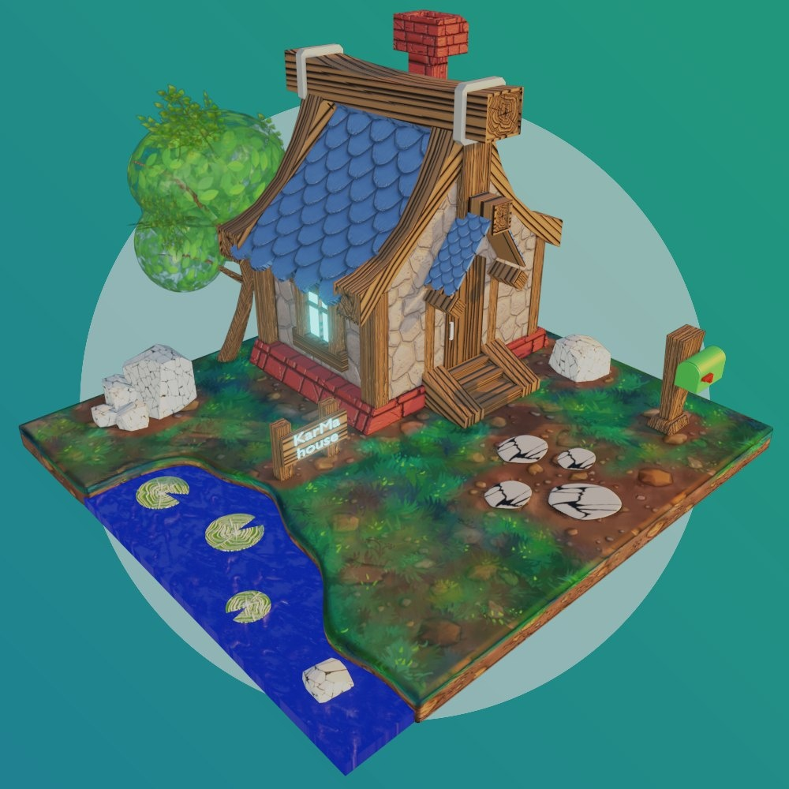
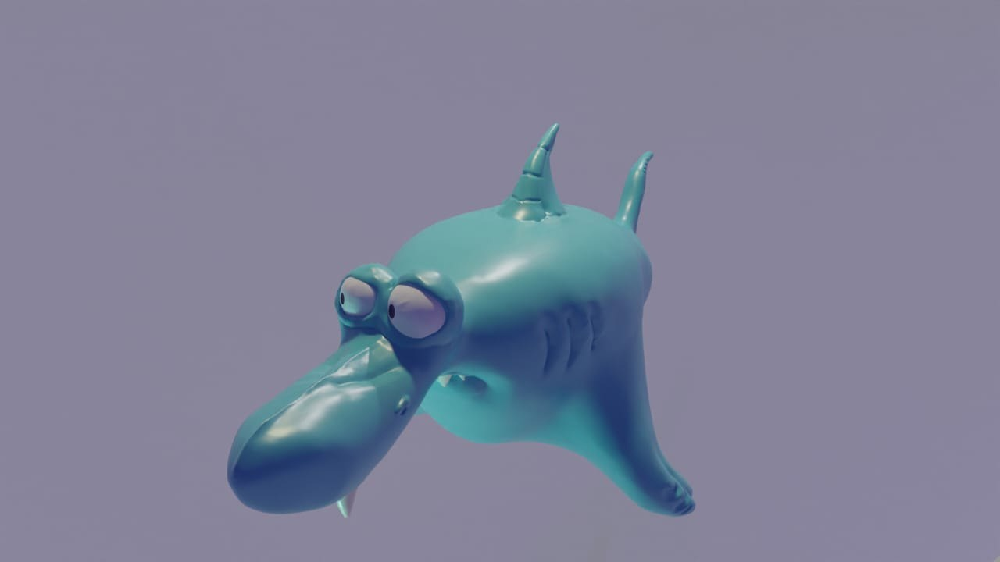

<!DOCTYPE html>
<html lang="en">
    <!-- 1:14:05 -->
<head>
    <meta charset="UTF-8">
    <meta name="viewport" content="width=device-width, initial-scale=1.0">
    
    <title>scroll</title>

    
    
    

    <link rel="stylesheet" href="KarMa-style.css">
    

</head>
<body>
    

        

            <header class="hero-section">
                <!-- Для движения картинка с отставанием (лагом)  -->
                <!--  -->
                
                

                    

                        <h1 class="main-title">Karim 
&
 Malika</h1>
                    

                

            </header>
        
            

                

                    <main class="gallery">
                        

                            
                            
                            
                                                        
                            

                                <h2 class="text-block__h">Что такое: no enter - no escape?</h2>
                                
Сломанная клавиатура!

                            

                            
                            
        
                        

                        

                            
                            

                                <h2 class="text-block__h">СРОЧНО ПРОДАМ!!!</h2>
                                
"мышь" в отличном состоянии, со всеми наворотами, пробег-5000 км!

                            

                            
                            
                            
        
                        

                    </main>
                

            

        

    

    

    <!-- <audio controls loop>
        <source src="img/repchik-m-4.mp3" type="audio/mpeg">
    </audio> -->

</body>
</html>
